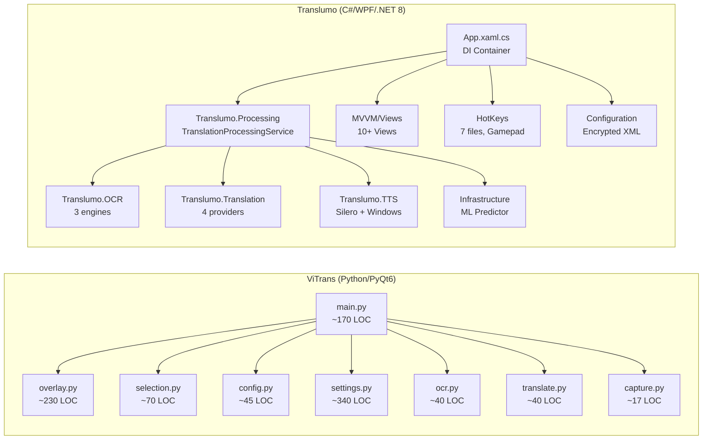
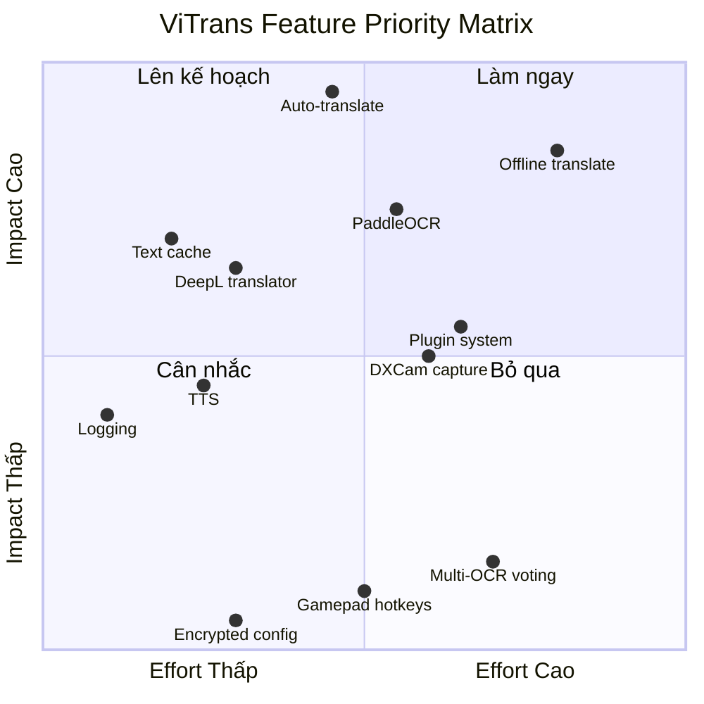

# ViTrans vs Translumo — Phân tích đối chiếu & Chiến lược phát triển

> **Ngày phân tích**: 2026-05-24  
> **Phiên bản ViTrans**: 1.0 (12 files Python, ~700 LOC)  
> **Phiên bản Translumo**: 1.0.2 (7 projects C#/.NET 8, ~15,000+ LOC)

---

## 1. Tổng quan kiến trúc đối chiếu



### Quy mô so sánh

| Tiêu chí | ViTrans | Translumo |
|---|---|---|
| **Ngôn ngữ** | Python 3.12 + PyQt6 | C# / .NET 8 + WPF |
| **Tổng LOC** | ~700 | ~15,000+ |
| **Số projects** | 1 package | 7 projects (solution) |
| **Kiến trúc** | Flat modules | MVVM + DI Container |
| **OCR engines** | 1 (EasyOCR) | 3 (WindowsOCR, Tesseract, EasyOCR) |
| **Translation providers** | 1 (Google) | 4 (DeepL, Google, Yandex, Papago) |
| **Screen capture** | MSS (screenshot) | DirectX DXGI (GPU-level) |
| **Config format** | JSON plaintext | Encrypted XML |
| **Hotkey system** | pynput (đơn giản) | Win32 RegisterHotKey + Gamepad (XInput) |
| **TTS** | ❌ Không có | ✅ Silero AI + Windows TTS |
| **ML scoring** | ❌ Không có | ✅ ML.NET text validity predictor |
| **Proxy** | ❌ Không có | ✅ Proxy rotation cho anti-block |
| **Logging** | ❌ Không có | ✅ Serilog (file-based) |
| **Update checker** | ❌ Không có | ✅ GitHub API auto-check |
| **i18n** | ❌ Chỉ Tiếng Việt | ✅ 2 ngôn ngữ giao diện (EN, RU) |

---

## 2. Những flow CẦN HỌC HỎI từ Translumo

### 🟢 2.1 — Auto-translate liên tục (Continuous Translation Loop)

**Đây là tính năng "sát thủ" của Translumo mà ViTrans hoàn toàn thiếu.**

Translumo có một vòng lặp dịch liên tục trong [TranslationProcessingService.cs](file:///F:/Dowload/Translumo-master/src/Translumo.Processing/TranslationProcessingService.cs#L121-L282):

```
While (!cancelled):
    Sleep(delay)           # 115ms–620ms tuỳ trạng thái
    screenshot = capture() # Chụp vùng đã chọn
    text = OCR(screenshot) # Nhận diện chữ  
    if text == cached:     # So sánh với cache
        continue           # Không dịch lại
    translated = translate(text)
    display(translated)    # Hiện lên overlay
```

**Ý nghĩa cho ViTrans**: Hiện tại, người dùng phải bấm nút "ViTrans" mỗi lần muốn dịch. Thêm chế độ auto-translate sẽ biến ViTrans thành công cụ hữu ích cho:
- Chơi game (text thay đổi liên tục)
- Đọc manga/manhwa (lật trang)
- Xem video có hardsub

> [!IMPORTANT]
> **Ưu tiên: CAO** — Đây là tính năng tạo ra khác biệt lớn nhất về UX. Nên triển khai sớm.

**Kế hoạch implement**:
1. Thêm nút Toggle "Auto" trên overlay top bar
2. Tạo `auto_translate.py` chứa background thread với loop
3. Sử dụng `TextResultCacheService` pattern từ Translumo — so sánh text similarity (Jaro-Winkler) để tránh dịch lại câu giống
4. Adaptive delay: 100ms khi text thay đổi, 500ms khi idle
5. Config: bật/tắt auto, điều chỉnh interval

---

### 🟢 2.2 — Text Result Cache & Deduplication

Translumo có hệ thống cache rất tinh vi tại [TextResultCacheService.cs](file:///F:/Dowload/Translumo-master/src/Translumo.Processing/TextProcessing/TextResultCacheService.cs):

- **Jaro-Winkler + Dice similarity** để phát hiện text "gần giống" (threshold 65%)
- **Translation cache** riêng biệt (threshold 95.5%) để tránh hiện bản dịch trùng
- **Cache lifetime** (3 giây) — tự xoá cache cũ
- **Sequential text detection** — phát hiện text đang cuộn (game dialog)

**ViTrans hiện tại**: Chỉ có `_TRANSLATION_CACHE` đơn giản (exact match) trong `translate.py`.

**Kế hoạch**: Tạo `text_cache.py` với fuzzy matching cơ bản, sử dụng thư viện `difflib.SequenceMatcher` (có sẵn trong Python stdlib).

---

### 🟢 2.3 — Multi-translator với Proxy Rotation & Failover

Translumo có kiến trúc [BaseTranslator](file:///F:/Dowload/Translumo-master/src/Translumo.Translation/BaseTranslator.cs) với:
- **TranslationContainer pattern**: Mỗi translator có multiple containers (mỗi container = 1 proxy connection)
- **Auto-failover**: Nếu container bị block → tự chuyển sang container khác
- **Block tracking**: Ghi nhận thời gian bị block, tự phục hồi sau timeout

**ViTrans hiện tại**: Chỉ dùng Google Translate, retry 2 lần, không có proxy.

**Kế hoạch**:
1. Tạo `ITranslator` interface pattern (abstract base class trong Python)
2. Implement `GoogleTranslator`, `DeepLTranslator` 
3. Thêm tuỳ chọn translator trong Settings
4. Retry với exponential backoff thay vì fixed 0.5s

---

### 🟡 2.4 — Screen Capture DirectX (DXGI)

Translumo dùng [ScreenDXCapturer](file:///F:/Dowload/Translumo-master/src/Translumo/Services/ScreenDXCapturer.cs) — capture trực tiếp từ GPU qua DirectX Desktop Duplication API:
- **Nhanh hơn nhiều** so với screenshot thông thường
- **Hoạt động với game fullscreen** (borderless)
- **Không bị chặn** bởi DRM/anti-cheat (hầu hết)

**ViTrans hiện tại**: Dùng `mss` library (GDI screenshot) — chậm hơn, có thể không capture được một số game.

**Kế hoạch**: Đây là optimization dài hạn. Trong Python, có thể dùng `d3dshot` hoặc `dxcam` library thay cho `mss`. Tuy nhiên, với use case hiện tại của ViTrans (dịch text tĩnh, không phải real-time game), `mss` là đủ tốt.

> [!NOTE]
> **Ưu tiên: TRUNG BÌNH** — Chỉ cần khi implement auto-translate cho game. MSS đủ cho use case hiện tại.

---

### 🟡 2.5 — Logging System

Translumo dùng Serilog với file rotation, log levels, structured logging. ViTrans không có logging nào.

**Kế hoạch**: Thêm `logging` module Python cơ bản:
```python
import logging
logging.basicConfig(
    filename=Path.home() / ".vitrans" / "vitrans.log",
    level=logging.INFO,
    format="%(asctime)s [%(levelname)s] %(message)s"
)
```

---

### 🟡 2.6 — Hotkey System Win32 (RegisterHotKey)

Translumo dùng [Win32 RegisterHotKey](file:///F:/Dowload/Translumo-master/src/Translumo/HotKeys/HotKey.cs) — API cấp hệ thống, không bị conflict với các app khác. Thậm chí hỗ trợ **Gamepad hotkeys** qua XInput.

**ViTrans hiện tại**: Dùng `pynput.keyboard.GlobalHotKeys` — hoạt động ở user-level, có thể bị conflict. 

**Kế hoạch dài hạn**: Có thể chuyển sang `ctypes` + `RegisterHotKey` API cho reliability, nhưng pynput đủ tốt cho MVP.

---

## 3. Những thứ THỪA THẢI trong Translumo (ViTrans nên TRÁNH)

### 🔴 3.1 — Over-engineering kiến trúc

| Translumo làm | Tại sao ViTrans KHÔNG nên theo |
|---|---|
| 7 C# projects riêng biệt | Quá nặng nề cho app ~700 LOC. Flat module structure của ViTrans đơn giản, dễ maintain hơn |
| Full DI Container (ServiceCollection) | Python không cần DI framework. Constructor injection thủ công đủ rồi |
| MVVM pattern với ViewModels, Commands, Bindings | PyQt6 signal/slot đơn giản hơn nhiều, đạt cùng kết quả |
| XML Serialization + AES Encryption cho config | JSON plaintext đủ tốt. Config ViTrans không chứa sensitive data |

### 🔴 3.2 — Multi-OCR Engine Voting

Translumo cho phép chạy **3 OCR engines đồng thời** rồi dùng ML model để chọn kết quả tốt nhất. Tuy nhiên, chính tác giả thừa nhận trong README:

> *"It is recommended to use **WindowsOCR** only. Tesseract is old, slow, and produces many errors. EasyOCR is even slower."*

**Kết luận**: Multi-OCR là legacy code, tác giả muốn xoá nhưng giữ lại vì lý do lịch sử. ViTrans không cần implement.

### 🔴 3.3 — Encrypted Configuration

Translumo mã hoá config bằng AES với password hardcoded (`"p@wd!"`) — security theatre, không có giá trị thực. ViTrans dùng JSON plaintext rõ ràng hơn, dễ debug hơn, user thậm chí có thể hand-edit.

### 🔴 3.4 — Python.NET Bridge

Translumo embed Python runtime bên trong C# app (cho EasyOCR) qua PythonNET — tạo ra rất nhiều complexity và bugs. ViTrans native Python, không cần bridge nào.

### 🔴 3.5 — Gamepad Hotkeys (XInput)

Hỗ trợ gamepad qua SharpDX.XInput — niche feature, phức tạp, ít người dùng.

---

## 4. UI — So sánh & Kế hoạch cải thiện

### 4.1 So sánh trực tiếp

| Khía cạnh | Translumo | ViTrans | Nhận xét |
|---|---|---|---|
| **Settings UI** | Material Design WPF, sidebar navigation (Languages → Appearance → OCR → Hotkeys) | EVKey-style QDialog, 3 grouped sections | ViTrans gọn hơn, phù hợp hơn cho app nhỏ |
| **Translation output** | Chat window riêng biệt (kiểu messenger) — text chạy dọc xuống | **In-place overlay** — text dịch đè lên vị trí gốc | ✅ **ViTrans tốt hơn!** In-place trực quan hơn nhiều |
| **Selection area** | Đường viền nét đứt cố định, cần hotkey riêng để hiện | Interactive drag-to-select | ViTrans linh hoạt hơn |
| **Color customization** | Color picker (full spectrum) | 6 preset colors | Translumo chi tiết hơn nhưng overkill |
| **Font settings** | Size, Bold, Color, Alignment, Line Spacing | Tự scale theo OCR bbox | ViTrans tự động, ít config hơn |
| **Status/Feedback** | Chat-style message log | Status text trên overlay | Mỗi cách có ưu điểm riêng |

### 4.2 Cải thiện UI đề xuất cho ViTrans

#### A. Overlay Top Bar — Thêm nút Auto-translate

```
Hiện tại:
┌─ [Vietnamese ▼] [ViTrans] [X] ─┐

Đề xuất:
┌─ [Vietnamese ▼] [▶ ViTrans] [🔄 Auto] [X] ─┐
```

- Nút `Auto` toggle chế độ dịch liên tục (đổi màu khi active)
- Nút `ViTrans` đổi thành `▶ ViTrans` (icon play)

#### B. Settings Window — Thêm tab Translation Engine

```
── Dịch thuật ──────
  Ngôn ngữ nguồn   [Tự phát hiện ▼]
  Ngôn ngữ đích     [Tiếng Việt ▼]
  Dịch vụ dịch      [Google Translate ▼]     ← MỚI

── Cơ bản ──────
  (giữ nguyên)

── Nâng cao ──────                            ← MỚI
  Auto-translate interval  [500ms ▼]
  OCR confidence threshold [35% ▼]

── Hệ thống ──────
  (giữ nguyên)
```

#### C. Translation History Panel (học từ chat window Translumo)

Thêm mini-panel bên dưới overlay (toggle ẩn/hiện) hiện lịch sử 5 câu dịch gần nhất — hữu ích khi text thay đổi nhanh (game, video).

---

## 5. Lợi thế phát triển của ViTrans

### ✅ 5.1 — Python Ecosystem là lợi thế khổng lồ

| Lĩnh vực | Python (ViTrans) | C# (Translumo) |
|---|---|---|
| OCR | EasyOCR, PaddleOCR, Tesseract-py — pip install | Phải bridge qua PythonNET hoặc P/Invoke |
| AI/ML | PyTorch, ONNX, Transformers — native | ML.NET (hạn chế), phải embed Python |
| Translation | deep-translator, googletrans, fairseq — đa dạng | Phải tự viết HTTP client cho từng API |
| TTS | pyttsx3, gTTS, Coqui TTS — 1 dòng pip | Phải code riêng từ đầu |
| Offline translate | CTranslate2, MarianMT — chạy local | Không khả thi trong C# |

**Kết luận**: ViTrans có thể tích hợp các model AI mới nhanh hơn Translumo 5-10x vì Python là ngôn ngữ mẹ đẻ của hệ sinh thái AI.

### ✅ 5.2 — In-place Translation (Killer Feature)

ViTrans render text dịch **ngay tại vị trí text gốc** trên overlay. Translumo chỉ hiện text dịch trong một chat window riêng biệt ở góc màn hình.

Đây là **lợi thế UX cực lớn**:
- Người dùng không cần rời mắt khỏi nội dung đang xem
- Tự nhiên hơn, giống đang đọc bản gốc nhưng bằng tiếng Việt
- Đặc biệt tốt cho manga, comic, tài liệu kỹ thuật

### ✅ 5.3 — Codebase gọn nhẹ, dễ contribute

- ~700 LOC vs ~15,000+ LOC
- Flat module, không cần hiểu DI/MVVM
- Python dễ đọc, dễ contribute hơn C#/WPF
- Setup dev environment chỉ `pip install -r requirements.txt`

### ✅ 5.4 — Cross-platform tiềm năng

PyQt6 + MSS chạy được trên macOS/Linux (với vài tweak nhỏ). Translumo dùng DirectX + WPF → locked vào Windows mãi mãi.

---

## 6. Roadmap tiềm năng phát triển ViTrans

### Phase A — Consolidate (v1.1) ⏱️ Ngắn hạn

| # | Feature | Từ Translumo? | Effort |
|---|---|---|---|
| A1 | **Auto-translate mode** (continuous loop) | ✅ Học hỏi | Trung bình |
| A2 | **Text result cache** (fuzzy dedup) | ✅ Học hỏi | Nhỏ |
| A3 | **Basic logging** (file-based) | ✅ Học hỏi | Rất nhỏ |
| A4 | **Thêm DeepL translator** | ✅ Học hỏi | Nhỏ |
| A5 | Cải thiện overlay top bar (nút Auto) | Thiết kế riêng | Nhỏ |

### Phase B — Differentiate (v1.5) ⏱️ Trung hạn

| # | Feature | Từ Translumo? | Effort |
|---|---|---|---|
| B1 | **Offline translation** (CTranslate2 + MarianMT) | ❌ ViTrans riêng | Lớn |
| B2 | **PaddleOCR** thay EasyOCR (nhanh + chính xác hơn) | ❌ ViTrans riêng | Trung bình |
| B3 | **TTS** — đọc bản dịch (gTTS / pyttsx3) | ✅ Có trong Translumo | Nhỏ |
| B4 | **Translation history panel** | ✅ Học hỏi (chat window) | Nhỏ |
| B5 | **DXCam capture** cho game | ✅ Concept từ Translumo | Trung bình |
| B6 | **Quốc tế hoá** giao diện (EN, VI) | ✅ Học hỏi | Nhỏ |

### Phase C — Dominate (v2.0) ⏱️ Dài hạn

| # | Feature | Mô tả | Effort |
|---|---|---|---|
| C1 | **AI-powered OCR** (PaddleOCR + layout analysis) | Nhận diện manga panels, bảng, biểu đồ | Lớn |
| C2 | **LLM translation** (local Gemma/Phi model) | Dịch chất lượng cao, hiểu context | Lớn |
| C3 | **Plugin system** | Cho phép community viết OCR/translator plugins | Trung bình |
| C4 | **macOS/Linux support** | PyQt6 đã hỗ trợ | Trung bình |
| C5 | **Image translation** (dịch text trong ảnh, giữ style gốc) | Inpainting + rendering | Rất lớn |

---

## 7. Tóm tắt chiến lược



> [!TIP]
> **Chiến lược cốt lõi**: ViTrans không cạnh tranh bằng "nhiều tính năng hơn" Translumo. ViTrans thắng bằng:
> 1. **In-place translation** — UX vượt trội
> 2. **Python AI ecosystem** — tích hợp model mới nhanh nhất
> 3. **Offline capability** — thứ Translumo không bao giờ có được (C# không có hệ sinh thái AI offline)
> 4. **Đơn giản & gọn nhẹ** — dễ dùng, dễ contribute, dễ maintain
